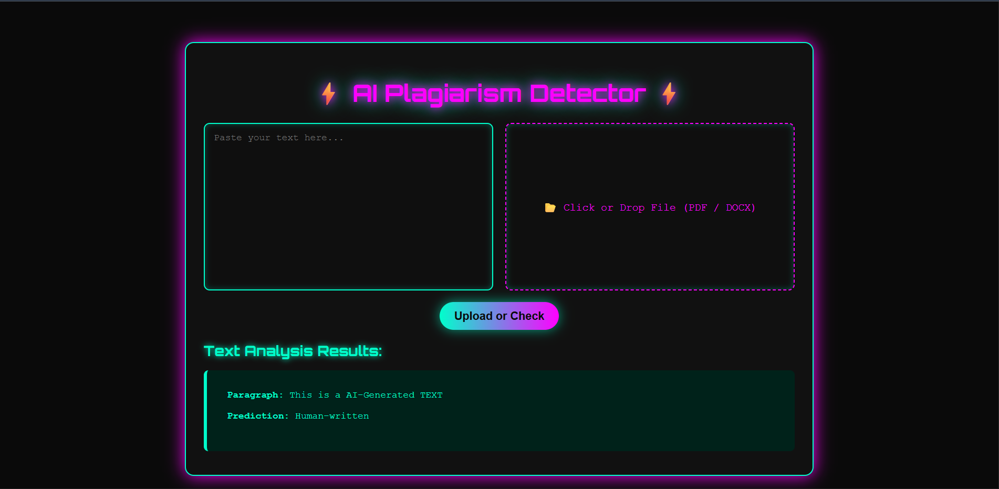
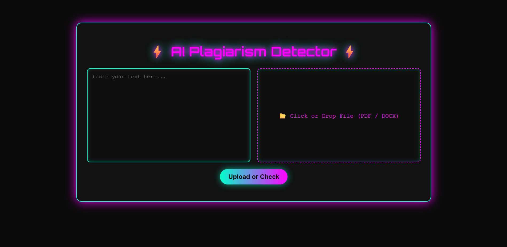
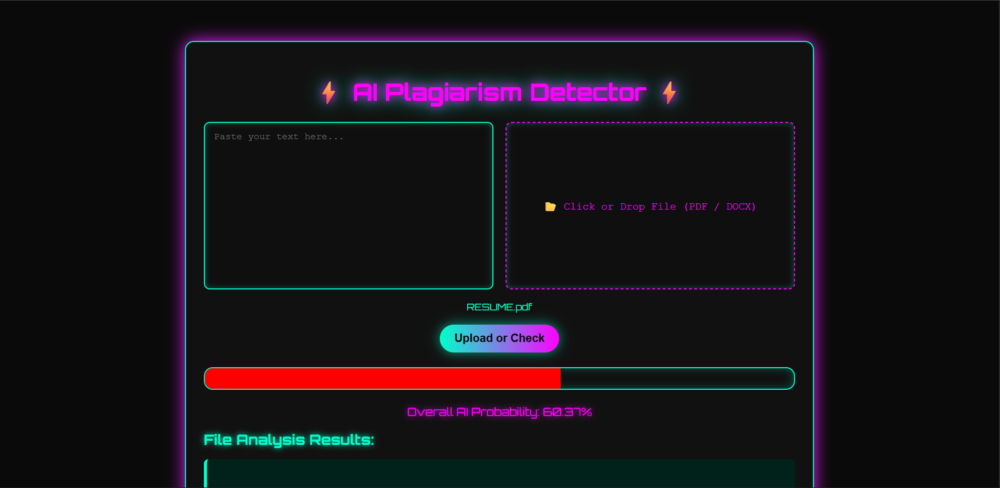
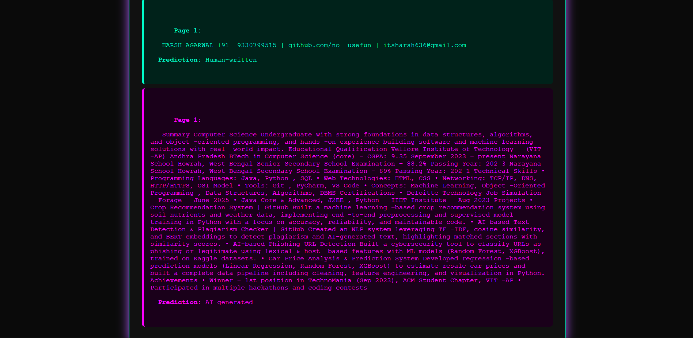

<div align="center">

# ⚡ AI Plagiarism Checker

AI-powered system that detects **AI-generated vs human-written text** using **TF-IDF vectorization and LightGBM classification**.


### Live Demo
https://ai-plagarism-checker-3jzr.onrender.com/

</div>

---

# Overview

This project is a **machine learning powered AI text detection and plagiarism analysis system**.

It analyzes text using **TF-IDF feature extraction** and classifies it using a **LightGBM model** to determine whether the content is **AI-generated or human-written**.

The system allows users to:

- Paste text for analysis
- Upload **PDF / DOCX files**
- View **AI probability scores**
- Get detailed analysis of each paragraph or page

---

# Screenshots

## Main Interface



---

## Text Input Mode



---

## File Upload + AI Probability



---

## Detailed File Analysis Output



---

# Features

- Detects **AI-generated vs human-written text**
- Supports **direct text input**
- Supports **PDF and DOCX file upload**
- Displays **AI probability score**
- Provides **detailed analysis output**
- Fast ML inference using **LightGBM**
- Modern **neon UI design**

---

# Tech Stack

### Backend
- Python
- Flask

### Machine Learning
- LightGBM
- Scikit-learn
- TF-IDF Vectorizer
- Pandas
- NumPy

### Frontend
- HTML
- CSS
- JavaScript

### Deployment
- Render

---

# System Architecture

```
User Input (Text / File)
        │
        ▼
Text Extraction (PDF / DOCX)
        │
        ▼
Text Preprocessing
        │
        ▼
TF-IDF Vectorization
        │
        ▼
LightGBM Model
        │
        ▼
Prediction
(AI Generated / Human Written)
```

---

# Project Structure

```
AI_plagarism_Checker
│
├── app.py
├── train_model.py
├── model.pkl
├── vectorizer.pkl
│
├── templates
│   └── index.html
│
├── screenshots
│   ├── p1.png
│   ├── p2.png
│   ├── p3.png
│   └── p4.png
│
├── requirements.txt
└── README.md
```

---

# Installation

Clone the repository

```
git clone https://github.com/no-usefun/AI_plagarism_Checker.git
```

Move into the project folder

```
cd AI_plagarism_Checker
```

Install dependencies

```
pip install -r requirements.txt
```

---

# Run Locally

Start the Flask server

```
python app.py
```

Open the application in your browser

```
http://127.0.0.1:5000
```

---

# Model Pipeline

```
Text / Document Input
        ↓
Text Extraction
        ↓
Cleaning & Preprocessing
        ↓
TF-IDF Vectorization
        ↓
LightGBM Classifier
        ↓
AI Probability + Prediction
```

---

# Future Improvements

- Sentence-level AI detection
- Highlight AI-generated sections
- Real plagiarism similarity scoring
- REST API for integration
- Larger dataset training

---

# Deployment

The application is deployed on **Render**.

Live Demo  
https://ai-plagarism-checker-3jzr.onrender.com/

---

# License

MIT License

---

# Author

Harsh Agarwal

GitHub  
https://github.com/no-usefun

Email  
itsharsh636@gmail.com
